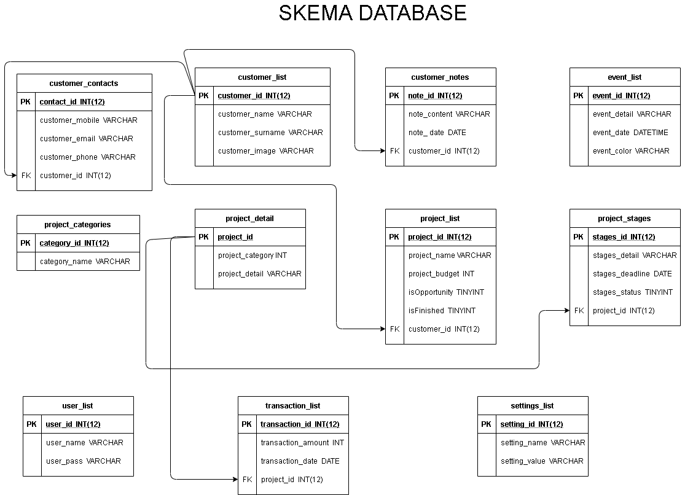

### Target Pengguna
targetpengguna : Masyarakat Indonesia yang membutuhkan penghasilan

Pandemi Covid-19 sudah masuk ke indonesia sejak bulan Februari.
Yang mana angka pengangguran di indonesia Bertambah Menjadi 6.88 Juta Orang pada Februari 2020.
Oleh karena itu kami membuat website freelance ini untuk menambah penghasilan bagi masyarakat indonesia yang dipecat perusahaannya atau yang masih mencari pekerjaan dan membutuhkan penghasilan tambahan.

### Skema Database

